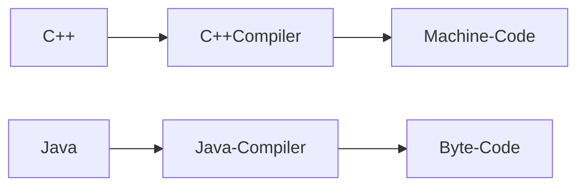
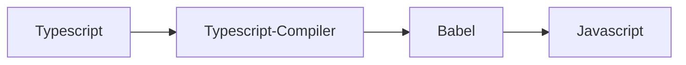
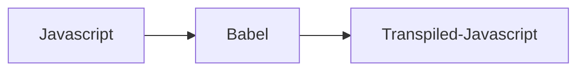

## 개요

Typescript, Babel, Webpack, Vite 등의 번들링, 트랜스파일링 등의 내용 정리\
이 문서를 통해 최종적으로 작성해야하는 소스 코드의 형태를 생각해볼 수 있음.

## Transpile?

컴파일은 특정 언어를 다른 수준의 언어로 변환하는 것으로 생각하자.



트랜스파일은 같은 수준의 언어로 변환하는 것으로 생각하면 되겠다.





## 왜 필요한가?

웹은 수많은 오픈소스들이 쌓여있는 하나의 산이다.\
다양한 도구들이 상호작용하며 생산성 높은 환경을 제공하기 위해 파이프라인을 구축해야한다.\
백엔드 개발과의 차이라면 IDE 표준 개발 환경 개념이 적다는 것이다.\
프론트엔드의 개발 환경은 빈번히 변경되며, 하나의 국한되어 있지 않는다.\
여러 도구를 결합하여 파이프라인을 언제든지 커스터마이징해야 하기 때문이다.

결국에는 수준 높은 도구를 활용하여 유지보수성과 확장성 등을 모두 확보하기 위해\
이런 도구들을 결합하여 써야한다는 의미이다.

타입스크립트를 쓰게된다면, 소스 내부의 타입 힌트를 통해 개발자들이 쉽게 추론된 타입으로\
코딩을 편하게 할 수 있고, 타입을 이용하여 정적인 코드 분석을 통해 실수를 미연해 방지할 수 있다.

바벨을 쓰게 된다면, 고수준 문법이나 API를 사용하더라도 브라우저 하위 호환성을 지켜주도록\
필요한 코드가 추가되거나 결과 코드가 변환되므로 생산성 높은 문법과 API를 사용하게 해준다.

다만, 다양한 프론트엔드 도구들이 뒤엉켜 어떤 것을 써야하는가에 대한 혼란을 주게되고\
빌드 파이프라인이 복잡해지며, 각 프로젝트마다 개발 환경이 통일되어 있지 않아\
package.json과 관련 빌드 scripts 폴더를 파악하고 구성하는데 굉장히 큰 시간을 소비한다.

## Typescript

javascript의 슈퍼셋 언어로, 타입을 더하는 것 이상으로\
정말로 타입이라는 개념을 스크립트로 작성하는 언어이다.\
vscode와 함께 사용할 시, language 서버 표준을 따르는\
타입스크립트 서버가 타입 스크립트 결과를 에디터에 반영하여\
어떤 타입이 추론되고, 어떤 타입이 적용되는지 보여준다.

타입스크립트 컴파일러는 단순히 문법적으로 변환만 해줄뿐,\
polyfill이 적용되지는 않기에 babel과 같이 써야\
브라우저 호환성이 보장된다는 점을 유의해야한다.

## Babel

javascript가 사용하고 있는 API 또는 문법을 타겟 브라우저에 맞게 변환(transform)해주는 트랜스파일러다.\
babel을 이용하여 최근 ECMA 표준 문법 또는 API을 사용하여도 반영이 되지 않은 브라우저에\
반영을 하게 할 수 있다.\
이러한 최신의 문법, API 등을 옛날 브라우저에 맞게 변환해주는 것을 transform이라고 한다.\
만능은 없고, 이러한 변환 과정 중에서 의도치 못한 코드 동작이 야기될 수 있으니,\
프론트엔드는 더욱 더 각 브라우저 환경마다 end 테스트가 중요하다.

## Webpack / Vite / Rollup

소스 코드를 어떻게 구축(build)할지, 어떤 도구들과 결합하여 결과물을 만들지 구성하는 도구이다.\
이 빌드 도구 안에 어떤 모듈 로더, 트랜스 파일러, 스타일 로더 등을 처리할지 지정하여\
최종적인 결과물을 만드는데에 쓰인다.

이 도구들 외에 다양한 빌드 도구들이 더 많이 있으며,\
각자 용도에 따라 크게 구분이 된다.

일반적인 프론트엔드 응용프로그램 프로젝트는 Webpack을 많이 사용하고,\
라이브러리 프로젝트는 Rollup을 사용한다.

Vite의 경우 응용프로그램이나 라이브러리 모든 환경에서 적합하다.\
(내부적으로 Rollup과 ESBuild를 사용한다.)

빌드 도구 내부에 어떤 도구끼리 체인을 걸어 결과물을 빌드할지를 의미하는 단어로\
toolchain이라는 용어를 사용한다. (e.g. webpack + typescript + sass + postcss)

## ESBuild / SWC

소스 코드를 번들링하는 것에 집중하는 번들러이다.\
ESBuild의 경우 Go 언어로 작성되었고, SWC는 Rust로 작성된 번들러이다.\
각자 개발 단계의 소스 코드를 제품 단계에 적합하게 패키징하고, split하는 기능에 초점이 맞춰져있다.

번들링 과정에서 참조하지 않는 코드는 제거되며, 식별자 이름을 난독화시킨다. (minifier)\
디버깅을 위한 파일로 .map 파일이 생성되며, tsc를 이용하여 d.ts 타입 정의 파일을 같이 제공할 수도 있다.\
타입 정의 파일은 개발자를 위해 제공하고, .map은 production 단계에서 디버깅이 필요한 환경일 때 필요하다.

이때, 완전 minified된 코드는 디버깅 시, map 파일과 실제 context 상의 식별자가 달라\
조금 불편한 부분이 있다. (물론 그마저도, production 식별자를 알려주긴한다.)\
그러므로, 디버깅을 위한 환경에서는 minified 되지 않은 소스 코드를 이용하는 것을 권장한다.

## Tree-shaking

실제 참조되지 않는 코드는 번들 결과에 필요가 없기에 그것을 제거하는 방식이다.\
어떤 번들러를 쓰냐에 따라 tree-shaking 알고리즘이 다르다.\
어떤 모듈 로더를 사용하고, 모듈의 import를 어떻게 처리하냐에 따라 번들 성능과 결과가 달라진다.

이를 위해 정적인 import를 쓰는 것이 효율적이며, 이는 아래와 같다.

```js
import { foo } from "./foo";
// 아래와 같은 코드는, tree-shaking 단계에서 더 많은 메모리를 사용한다.
// bar 내부의 어떤 멤버를 사용했고 안 했는지 판단해야하기 때문이다.
import * as bar from "./bar";
```

CJS 같은 방식으로 동적인 import를 이용하는 경우 비효율적이다.

```js
const foo = require("./foo");
```

대부분의 브라우저 단의 모듈로는 static import(ESM)을 기본으로 사용하고\
번들러를 통해 이 부분을 AMD나 UMD 등으로 transform하면 되겠다.

## 참조

- [What is a transpiler?](https://www.bam.tech/article/what-is-a-transpiler)
- [트리 쉐이킹으로 자바스크립트 페이로드 줄이기](https://ui.toast.com/weekly-pick/ko_20180716)
