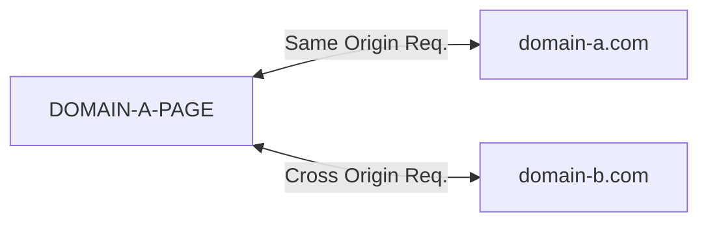

## CORS

교차 출처 리소스 공유(Cross-Origin-Resource-Sharing)는 여러 소스간의 자원에 접근할 수 있도록\
브라우저에 알려주는 웹 표준 체제이다. 웹은 자신의 출처와 다른 출처(도메인, 프로토콜, 포트)의 리소스를 다룰 때 CORS HTTP 요청을 실행한다.\
CORS HTTP 요청 결과에 따라 브라우저는 다른 출처의 리소스를 제한한다.

### CORS 요청이 발생하는 경우

아래 항목에 해당하는 호출에서 서로 다른 출처를 가진 경우 발생한다.

- `XMLHttpRequest` 또는 `fetch` 호출
- 웹 폰트(CSS 내 @font-face)에서 교차 도메인 폰트 사용 시
- [WebGL 텍스처](https://developer.mozilla.org/ko/docs/Web/API/WebGL_API/Tutorial/Using_textures_in_WebGL)
- [drawImage를 사용해 캔버스에 그린 이미지/영상](https://developer.mozilla.org/en-US/docs/Web/API/CanvasRenderingContext2D/drawImage)
- [이미지로 추출하는 CSS Shapes](https://developer.mozilla.org/en-US/docs/Web/CSS/CSS_Shapes/Shapes_From_Images)

### CORS 발생 케이스

- `https://domain-a.com` 기준으로 아래 케이스를 확인해보자.

| 출처                              | 구분 | 이유                                                     |
| --------------------------------- | ---- | -------------------------------------------------------- |
| https://domain-a.com/blog/1       | SOP  | 프로토콜, 호스트, 포트 모두 동일                         |
| http://domain-a.com/blog/1        | CORS | 프로토콜이 다름                                          |
| https://domain-b.com/blog/1       | CORS | 호스트가 다름                                            |
| https://domain-a-.com:8088/blog/1 | CORS | 포트가 다름 (IE는 포트가 달라도 Same Origin)으로 처리함) |

## 왜 CORS 정책이 필요한가?

이것은 의도하지 않은 다른 도메인에서 호출하는 코드가 서버에 위협이 될 수도 있기 때문이다.\
예를들어 서버에서 지정되지 않은 `domain-extra.com`(이하 `ext`로 칭함)가 있다고 가정하자.\
`ext`에서 서버에 임의의 API 요청을 보내 마음대로 Application을 구성할 수도 있고\
사용자의 정보를 탈취할 수도 있다.

## CORS HTTP

## 결론

## 참조

- [웹 보안 기초](https://velog.io/@hwnim5324/%EC%9B%B9%EA%B0%9C%EB%B0%9C-%EB%A1%9C%EB%93%9C%EB%A7%B5-8.-%EC%9B%B9-%EB%B3%B4%EC%95%88-%EA%B8%B0%EC%B4%88)
- [CORS - MDN](https://developer.mozilla.org/ko/docs/Web/HTTP/CORS)
- [CORS는 왜 이렇게 우리를 힘들게 하는걸까?](https://evan-moon.github.io/2020/05/21/about-cors/)
