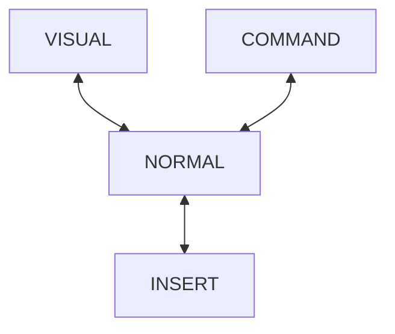

## VIM 모드

VIM은 현재 모드에 따라 사용할 수 있는 명령과 입력 동작이 달라진다.\
이 점이 일반 편집기에 적용된 유저가 사용하기 까다로운 부분들이다.\
처음에는 NORMAL모드로 시작하여 여러가지 커맨드 명령을 실행하거나\
다른 모드로 전환하여 작업할 수 있다.

- NORMAL MODE (일반 모드)

  첫 실행 시 적용되는 모드.\
  일반 모드에서 다른 모드를 접근할 수 있음.\
  일반 모드에서 일반 문서 입력을 예상하고 키를 누르면 안된다.\
  커서의 움직임이나 다른 명령이 실행된다.

  - h: 왼쪽
  - j: 아랫줄
  - k: 윗줄
  - l: 오른쪽
  - {숫자}{방향}: 4j -> 4줄 아래
  - w: 다음 단어 시작
  - b: 이전 단어 시작
  - e: 단어의 끝
  - W: 다음 whitespace 이후 문자
  - B: 이전 whitespace 이후 문자
  - E: whitespace 이후 단어의 끝
  - 0: 현재 라인의 첫 시작 문자
  - $: 현재 라인의 마지막 문자
  - u: undo 기능 수행
  - ctrl + r: redo 기능 수행
  - x: 현재 커서의 문자 제거
  - X: 현재 커서 이전 문자 제거
  - r: 현재 문자 다음 입력 문자로 치환

- INSERT MODE

  NORMAL 모드에서 전환하여 문서 내용을 입력하는 모드 3가지 명령을 이용해 전환할 수 있음.

- VISUAL MODE

- COMMAND MODE

## 주요 단축키

- 

## 참조

- <https://vim.rtorr.com/lang/ko>
- <https://www.freecodecamp.org/news/vim-editor-modes-explained/>